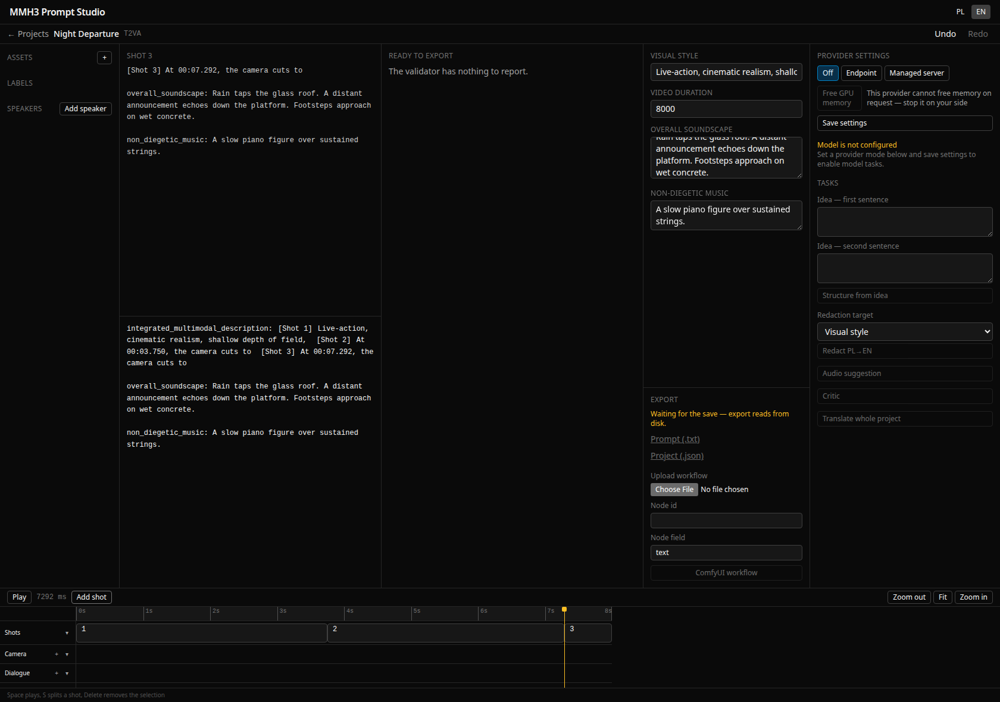
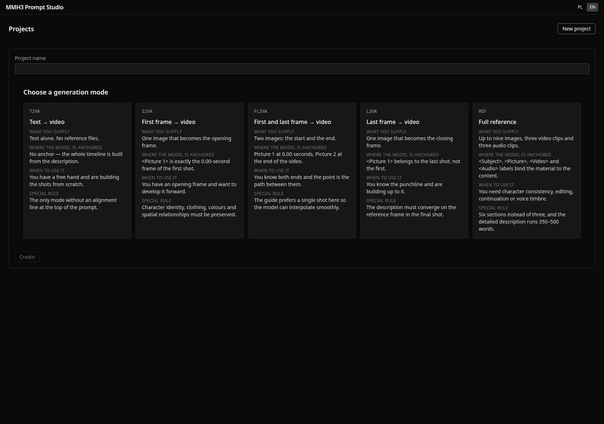
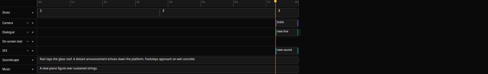
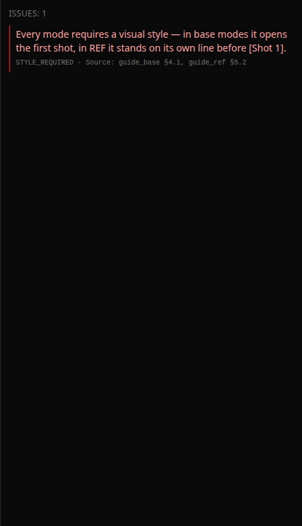
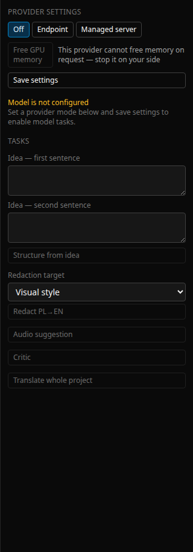
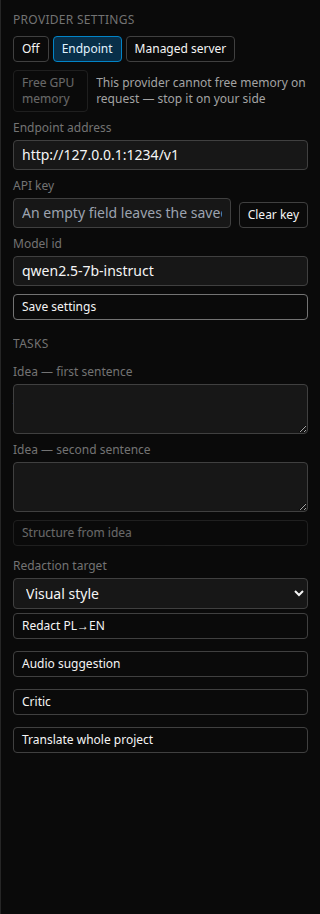

# MMH3 Prompt Studio

A local, offline desktop-style web app for writing prompts for the **MiniMax-H3** video model — built like a non-linear video editor rather than a form.

You lay out shots on a timeline, drag the cuts, put camera moves and dialogue on their own tracks, and watch the finished prompt compile live beside them. A validator checks the result against the model's own prompt-writing guides and cites the section it is quoting. When you are done you export the prompt as text, or inject it straight into a ComfyUI workflow file.

Nothing leaves your machine. The app never talks to MiniMax, and video generation happens separately in ComfyUI.



---

## Contents

- [Why this exists](#why-this-exists)
- [What it does](#what-it-does)
- [Requirements](#requirements)
- [Install and run](#install-and-run)
- [A first project, step by step](#a-first-project-step-by-step)
- [The five prompt modes](#the-five-prompt-modes)
- [The timeline](#the-timeline)
- [The validator](#the-validator)
- [Local model assistance](#local-model-assistance)
- [Freeing GPU memory before ComfyUI](#freeing-gpu-memory-before-comfyui)
- [Export](#export)
- [Keyboard shortcuts](#keyboard-shortcuts)
- [Where your data lives](#where-your-data-lives)
- [Development](#development)
- [Architecture](#architecture)
- [Design decisions worth knowing](#design-decisions-worth-knowing)
- [Known limitations](#known-limitations)

---

## Why this exists

MiniMax-H3 prompts are long, structured English documents with strict conventions: shot headers carrying timestamps to the millisecond, camera motion drawn from a fixed vocabulary, spoken lines wrapped in `<d>` tags with the language named, transition markers, and — in reference mode — a retention analysis that has to name the shots each label appears in.

Writing that by hand in a text box means keeping a dozen rules in your head and rediscovering the same mistakes. Writing it on a timeline means the structure is the thing you manipulate, and the prompt is what falls out of it.

## What it does

- **A multi-track timeline** — shots, camera moves, one dialogue lane per speaker, on-screen text, sound effects, soundscape, music, and reference labels in REF mode.
- **Live compilation** — the prompt is rebuilt on every edit, so you always see what the model will read.
- **43 validator rules** drawn from the two official prompt-writing guides, each citing its source section.
- **Five prompt modes** with the format differences handled for you.
- **Frame-accurate editing** at 24 fps, with cut times snapped to the frame grid.
- **Local model assistance** — optional, and the app is fully usable without it.
- **ComfyUI export** — pick a node and a field once, and the app writes your prompt into a copy of your workflow.
- **Bilingual interface**, Polish and English. The prompt itself is always English.
- Autosave, full undo/redo, and projects stored as plain folders you can read and back up.

## Requirements

- **Node.js 20 or newer** (developed on 20.20).
- A modern browser. That is all — there is no database and no cloud service.
- Optional, for model assistance: a local OpenAI-compatible server (LM Studio, Ollama, vLLM, `llama-server`), or a `llama-server` binary and a `.gguf` file for the app to manage itself. A CUDA GPU helps but is not required.

## Install and run

```bash
git clone https://github.com/quzopl/mmh3-prompt-studio.git
cd mmh3-prompt-studio
npm install
```

Then start the two processes — the API and the web interface:

```bash
# terminal 1 — the API (port 8899)
npm run dev:api

# terminal 2 — the interface (port 5173)
npm run dev:web
```

Open <http://localhost:5173>.

To serve the interface on another port and expose it on your network, run Vite
from the `web/` workspace — its config resolves `index.html` relative to the
working directory, so starting it from the repository root serves a 404:

```bash
cd web && npx vite --port 9921 --host 0.0.0.0 --strictPort
```

The API port and the data directory are set with environment variables:

```bash
MMH3_PORT=9000 MMH3_DATA_ROOT=/path/to/projects npm run dev:api
```

## A first project, step by step

**1. Create a project and pick a mode.** Each mode has a short description of what it is for, so you do not have to remember the acronyms.



**2. Fill in the visual style.** The validator will tell you it is required — that is expected on a fresh project, and it is the fastest way to see the validator working.

**3. Split the video into shots.** Click the ruler to place the playhead, press **S** or *Add shot*. Drag the seam between two clips to re-time a cut; the boundary snaps to the frame grid and cannot cross its neighbours.

**4. Fill in the shots.** Select a clip and use the inspector on the right. Add camera moves, dialogue lines, on-screen text and sound effects with the **+** button in each track's header — the new object lands at the playhead.

**5. Watch the prompt.** The middle column shows the compiled prompt; the monitor above it shows just the shot under the playhead.

**6. Export** when the validator reports no errors.

## The five prompt modes

| Mode | What it is for |
|---|---|
| **T2VA** | Text to video with audio. The whole film is described in words; nothing is supplied as reference material. |
| **I2VA** | Image to video. One image anchors the first frame, and the prompt describes what happens from there. |
| **FL2VA** | First and last frame. Two images anchor the ends and the prompt describes the journey between them. |
| **L2VA** | Last frame. One image anchors the ending, and the prompt describes how the film arrives there. |
| **REF** | Reference mode. Subjects, pictures, videos and audio are given as labelled material (`<Subject 1>`, `<Video 1>`), reused across shots, with a retention analysis stating how faithfully each must be preserved. |

The modes differ in format, not merely in wording — REF produces six sections rather than three, and the image-based modes need frame anchors before they are complete. The app knows which is which and only offers what belongs.

## The timeline



- **Shots** — one clip per shot. Drag a seam to re-time a cut.
- **Camera** — camera moves live inside their shot and cannot be dragged outside it, because the validator forbids that.
- **Dialogue** — one lane per speaker, so two people talking at once are visible side by side. A line spoken by two people appears in both lanes; it is one object seen twice. Each clip shows a dashed shadow of how long the words would actually take to speak, so you can see whether a line fits the room you gave it.
- **On-screen text** — spans its shot, because that is all the model records about it.
- **SFX** — diegetic sounds, free to cross a cut.
- **Soundscape** and **Music** — one clip each spanning the whole video, because that is how the format describes them.
- **References** — REF only. One row per label, one cell per shot; click a cell to say the label appears there. This drives the `(appears in [Shot 1], [Shot 3])` note in the retention analysis.

Track headers stay put while the clips scroll. Any track can be collapsed. **Fit** sizes the material to the window.

## The validator



Every rule names the guide section it enforces, so a complaint is checkable rather than an opinion. Rules are graded: an **error** blocks export, a **warning** is worth reading, a **hint** is advice.

The app treats the validator as the definition of correct. A recurring principle in the code is that **no interface action may produce a diagnostic on a project that did not have one** — if a button leaves your project in a state the validator complains about, that is a bug in the button, not a fact about your project.

## Local model assistance

Entirely optional. Without a model configured the panel is greyed out with an explanation and everything else works normally.



Two ways to connect one:

**Endpoint** — point the app at any OpenAI-compatible server. Works with LM Studio (`http://localhost:1234/v1`), Ollama (`http://localhost:11434/v1`), vLLM, or a `llama-server` you started yourself. The API key is optional; local servers do not need one.

**Managed server** — give the app a path to a `llama-server` binary and a `.gguf` file, and it will start the process, wait for it to answer, stream its log into the panel, and stop it when you ask.



Five tasks:

| Task | Input | Output |
|---|---|---|
| **Structure from idea** | Two sentences, plus the mode and duration | A whole shot structure with times, camera moves and dialogue |
| **Redact PL→EN** | One field | The same field in English, in the guide's conventions |
| **Translate whole project** | Everything written as prose | One patch translating all of it |
| **Audio suggestion** | The shot content | A soundscape and a music description |
| **Critic** | The compiled prompt | Notes pointing at specific objects |

Two rules govern all of it:

- **The model never writes into your project directly.** It returns a *patch* — a list of named changes, each shown with its before and after, and **nothing is selected by default**. You choose what to accept. Accepting is a decision, not the absence of an objection.
- **Critic notes are not validator rules.** They appear in their own group in the validation panel, marked as coming from a language model, and they can never block export. A rule cites the guide and is provable; a note is an opinion that may be confidently wrong.

The API key is stored on the server, redacted from every response, and never written into a project file or an export. Leaving the key field blank on save keeps the stored key; **Clear key** removes it.

### Prompts are always English

You may write in Polish — many people think faster in their own language. **Translate whole project** converts everything that is prose into English in one pass, and you accept the results field by field. Spoken lines inside `<d>` blocks are never translated: a character speaking Polish on screen is deliberate content, not a mistake to fix.

## Freeing GPU memory before ComfyUI

The point of this app is to produce a prompt and then generate video in ComfyUI. On a single GPU those two things compete for the same VRAM, so the panel has a **Free GPU memory** button.

There is no universal way to do this, so the button tells you what it can actually do for your provider:

| Provider | What the button does |
|---|---|
| **Managed `llama-server`** | Stops the process — a complete release. The panel then shows the server as stopped. |
| **Ollama** | Sends `keep_alive: 0`, which unloads the model. |
| **LM Studio** | Uses its own unload API. |
| **Plain OpenAI-compatible endpoint** | Nothing to call — the button is disabled with an explanation rather than pretending. |

If the release fails it says so with a reason. It will never claim success it did not achieve, because the cost of that mistake is starting a video generation believing you have free VRAM when you do not.

## Export

- **Prompt (.txt)** — the compiled prompt.
- **Project (.json)** — the whole project, for backup or hand-editing.
- **ComfyUI workflow** — upload your workflow JSON once, name the node id and the field that should receive the prompt, and the app writes you a copy with the prompt injected. The mapping is saved, so the next export is one click. There is no network call to ComfyUI; you get a file and drop it in yourself.

Export is blocked while the validator reports an error, and while unsaved changes are still being written — the export reads from disk, so it waits for the save rather than handing you something stale.

## Keyboard shortcuts

| Key | Action |
|---|---|
| `Space` | Play / pause |
| `←` `→` | Step one frame |
| `Shift` + `←` `→` | Step one second |
| `Home` `End` | Jump to start / end |
| `S` | Split the shot at the playhead |
| `Delete` | Remove the selection |
| `Ctrl/Cmd + Z` | Undo |
| `Ctrl/Cmd + Shift + Z` | Redo |

Shortcuts never fire while you are typing in a field.

## Where your data lives

```
~/mmh3-studio/projects/
    <project-name>/
        project.json      the whole project
        assets/           images, video and audio you uploaded
        exports/          generated files
    llm-settings.json     provider settings, machine-wide
```

Projects are plain JSON. You can read them, diff them, and put them in version control. The provider settings sit **outside** any project folder so an API key never travels with a project you send to someone.

## Development

```bash
npm test           # 1103 unit tests across the three workspaces
npm run typecheck  # strict TypeScript, all three workspaces
npm run e2e        # 5 Playwright tests in real Chromium
```

The repository holds three npm workspaces:

| Workspace | What it is |
|---|---|
| `shared/` | The domain model, the compiler, the 43 validator rules, the patch format. No I/O, no framework. |
| `server/` | Fastify: project storage, asset uploads, export, and everything that talks to a language model. |
| `web/` | React and Vite: the editor, the timeline, the panels. |

There is also a command-line compiler that prints a project's prompt and its
diagnostics. Give it an **absolute** path — npm runs the script from the
`shared/` workspace, so a relative path resolves against that directory, not
your shell's. It exits non-zero when the validator reports an error, which makes
it usable in a check script:

```bash
npm run mmh3c --workspace @mmh3/shared -- "$PWD/projects/my-project/project.json"
```

Screenshots in this README are generated, not hand-taken:

```bash
cd web && MMH3_SHOTS=1 npx playwright test e2e/screenshots.spec.ts
```

## Architecture

The compiler is a pure function from a project to a prompt, tested against the vendor's own worked examples reproduced byte for byte. The validator is a registry of independent rules over the same model. Neither knows anything about React or HTTP, which is why the CLI and the server can share them.

Time is handled in **frame indices**, not milliseconds, everywhere it matters. A frame at 24 fps is 41.666… ms, so millisecond arithmetic drifts off the grid for about a third of positions — a lesson this codebase learned by shipping the bug and then measuring it.

The browser never speaks to a language model. Everything goes through the server, which owns the API key and the managed process.

## Design decisions worth knowing

**The model proposes, you dispose.** Every language task returns a patch you review. This is why the app can use a small local model without much risk — a wrong suggestion costs you a glance, not your project.

**The validator is the contract.** Interface actions are held to the rule that they must not introduce a diagnostic. Where a diagnostic is genuinely honest — you added a line in the last half-second of the video and it does not fit — it is allowed, listed explicitly, and documented.

**Derived state has exactly one owner.** Shot ordering, camera moves staying inside their shots, speaker introductions and reference scopes are all recomputed by a single normalisation function that every write passes through.

**Undo is one entry per intention.** A drag is one entry however many mouse moves it took; accepting three patch operations at once is one entry; an action that changes nothing writes no entry at all.

## Known limitations

- **Camera move times and the SFX track do not reach the prompt.** They are validated and editable, but the compiler's output does not depend on them yet. `docs/superpowers/specs/2026-08-04-uwagi-do-planu-2.md` tracks this and other known gaps in detail.
- **No keyboard resizing of clips.** Clip edges are drag-only; the handles are deliberately not focusable rather than promising something Enter cannot deliver.
- **The managed-server path has not been run against a real `llama-server`** in the development environment, which has no such binary. The three things worth checking on a real CUDA machine are listed in the task report under `.superpowers/sdd/`.
- **Prompt quality depends on your model.** The app enforces shape — sentence counts, vocabulary, markup — not taste.

---

Built with [Claude Code](https://claude.com/claude-code).
